# Separable Variational Autoencoder (VAE) for Ecological Data

This repository contains a PyTorch implementation of a **Separable Variational Autoencoder**, a novel neural network architecture designed for analyzing ecological community data (e.g., species abundances).

The core innovation of this model is its ability to disentangle the sources of variation in community structure. It separates the patterns that can be explained by measured environmental variables from other, latent patterns that may arise from biotic interactions, unmeasured environmental factors, or stochastic events.

The script includes:
* A synthetic data generator that creates realistic ecological data with known properties.
* The `SeparableVAE` model class in PyTorch.
* A complete training and evaluation pipeline.
* Helper functions for diagnostics and reporting.

---

## Model Architecture

The Separable VAE modifies the standard VAE framework by incorporating two distinct latent spaces, each with its own encoder:

1.  **The Salient Latent Space ($z_{salient}$)**: This space captures patterns in species abundances that are predictable from the environmental covariates. A dedicated **Regressor** network learns a mapping from the environmental data directly to the parameters of this latent space.

2.  **The Private Latent Space ($z_{private}$)**: This space captures the remaining, unexplained variation in species abundances. A standard VAE **Encoder** network learns a mapping from the species abundance data to the parameters of this latent space.

A single **Decoder** network then takes the concatenated vector from both latent spaces (`[z_salient, z_private]`) to reconstruct the original species abundance data.

This separation is enforced by a composite loss function that includes:
* A reconstruction term to ensure the model accurately reproduces the input data.
* Two separate KL divergence terms, one for each latent space, weighted by their own beta hyperparameters (`β_salient` and `β_private`). This allows for differential regularization of the two spaces.

### Archictectural sketch

```mermaid
graph TD
    %% Input Data
    X_env[Environmental Data<br/>x_env: n_env_covariates] --> R1
    X_conc[Concentration Data<br/>x_conc: n_taxa] --> E1
    
    %% Regressor Branch (Salient Latent Space)
    subgraph Regressor["🌍 Regressor Network (Environment → Salient)"]
        R1[Linear Layer] --> R2[ReLU]
        R2 --> R3[Linear Layer] 
        R3 --> R4[ReLU]
        R4 --> R5[...]
        R5 --> R_mu[regressor_mu<br/>Linear → k_salient_dims]
        R5 --> R_logvar[regressor_logvar<br/>Linear → k_salient_dims]
    end
    
    %% Encoder Branch (Private Latent Space)  
    subgraph Encoder["🔬 Private Encoder (Concentrations → Private)"]
        E1[Linear Layer] --> E2[BatchNorm1d]
        E2 --> E3[ReLU]
        E3 --> E4[Dropout]
        E4 --> E5[Linear Layer]
        E5 --> E6[BatchNorm1d]
        E6 --> E7[ReLU] 
        E7 --> E8[Dropout]
        E8 --> E9[...]
        E9 --> E_mu[private_mu<br/>Linear → k_private_dims]
        E9 --> E_logvar[private_logvar<br/>Linear → k_private_dims]
    end
    
    %% Reparameterization
    R_mu --> Reparam_S[Reparameterize<br/>z_salient = μ + ε·σ]
    R_logvar --> Reparam_S
    E_mu --> Reparam_P[Reparameterize<br/>z_private = μ + ε·σ]
    E_logvar --> Reparam_P
    
    %% Latent Spaces
    Reparam_S --> Z_salient[z_salient<br/>k_salient_dims]
    Reparam_P --> Z_private[z_private<br/>k_private_dims]
    
    %% Concatenation
    Z_salient --> Concat[Concatenate]
    Z_private --> Concat
    Concat --> Z_combined[z_combined<br/>k_salient_dims + k_private_dims]
    
    %% Decoder
    subgraph Decoder["🔄 Shared Decoder"]
        Z_combined --> D1[Linear Layer]
        D1 --> D2[BatchNorm1d]
        D2 --> D3[ReLU]
        D3 --> D4[Dropout]
        D4 --> D5[Linear Layer]
        D5 --> D6[BatchNorm1d]
        D6 --> D7[ReLU]
        D7 --> D8[Dropout]
        D8 --> D9[...]
        D9 --> D10[Linear → n_taxa]
        D10 --> D11[Hardtanh<br/>min=-1.0, max=8.0]
    end
    
    %% Output
    D11 --> Output[Reconstructed<br/>Concentrations<br/>n_taxa]
    
    %% Loss Components (shown as annotations)
    R_mu -.-> Loss_KL_S[KL Loss Salient<br/>beta_salient × KL]
    R_logvar -.-> Loss_KL_S
    E_mu -.-> Loss_KL_P[KL Loss Private<br/>beta_private × KL]
    E_logvar -.-> Loss_KL_P
    Output -.-> Loss_Recon[Reconstruction Loss<br/>MSE output target]
    
    %% Styling
    classDef input fill:#e1f5fe
    classDef regressor fill:#f3e5f5
    classDef encoder fill:#e8f5e8
    classDef decoder fill:#fff3e0
    classDef latent fill:#fce4ec
    classDef loss fill:#ffebee
    
    class X_env,X_conc input
    class Z_salient,Z_private,Z_combined latent
    class Output input
    class Loss_KL_S,Loss_KL_P,Loss_Recon loss
```

## Key Features

* **Disentanglement**: Explicitly separates the influence of measured environmental drivers from other intrinsic or unmeasured dynamics within an ecological community.
* **Interpretability**: Provides two distinct, lower-dimensional representations of the community data, where one is tied to the environment and the other represents residual patterns.
* **Predictive Modeling**: The regressor component can be used independently to predict the "environmentally-determined" component of a community's structure under new or hypothetical environmental conditions.
* **Hypothesis Generation**: By analyzing the private latent space, researchers can identify co-occurrence or exclusion patterns that are independent of shared environmental preferences, pointing toward potential biotic interactions.

## 🔬 Applications in Ecology Research

This model architecture is a powerful tool for tackling several key questions in community ecology:

* **Disentangling Abiotic vs. Biotic Drivers**: The model's primary use is to separate the influence of measured environmental drivers from other dynamics. Researchers can quantify the variation in community structure explained by the environment (**$z_{salient}$**) versus other latent factors (**$z_{private}$**), moving beyond simple correlation to a more mechanistic understanding.

* **Identifying Putative Biotic Interactions**: By analyzing the private latent space, you can find species that consistently co-occur or exclude each other for reasons *not* related to shared environmental needs. This generates strong, testable hypotheses about competition and facilitation.

* **Community-Level Niche Modeling**: The model's regressor can predict how a community's core structure will shift along environmental gradients. This is useful for forecasting the ecological impacts of climate change or other disturbances.

* **Interpretable Dimensionality Reduction**: Like other ordination methods, the Separable VAE reduces complex species data to a few key axes. However, these axes have a clear, built-in interpretation (e.g., "environmental axis 1," "biotic axis 1"), making visualizations more insightful.

* **Anomaly Detection**: A sample with an unusual position in the private latent space could represent a unique biological event, like a disease outbreak or a transient algal bloom, that isn't captured by standard environmental data.
  